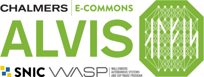

# Batch Connect - Alvis OnDemand Codeserver

Interactive App Plugin for running Codeserver at [Alvis OnDemand](https://portal.c3se.chalmers.se).

This app was inspired by the [OSC VS Code Server App](https://github.com/OSC/bc_osc_codeserver).

## Prerequisites

This app is developed for Alvis OnDemand. It currently requires a `code-server`
module available with:

```
$ module load code-server
```

Tested with:
* VS Code Server >= 4.9.1

## Install
The app itself is self-contained and should only need to be placed as e.g.
`/var/www/ood/apps/sys/bc_alvis_codeserver`.

```
$ cd /var/www/ood/apps/sys/
$ git clone https://github.com/c3se/bc_alvis_codeserver.git
```

## Customizations
You can customize the user data directory and the extensions directory
respectively by setting the following variables in
`~/portal/vscode/vscode1.sh`

```
$ CODESERVER_USER_DATA_DIR=$HOME/my_codeserver_data
$ CODESERVER_EXTENSIONS_DIR=$HOME/my_extensions
```
To read more about extensions see this [link](https://code.visualstudio.com/docs/editor/extension-marketplace).

## License
[Visual Studio Code](https://github.com/microsoft/vscode) is copyright by Microsoft.

The Visual Studio Code logo is used according to the [Icons and name usage guidelines](https://code.visualstudio.com/brand).
